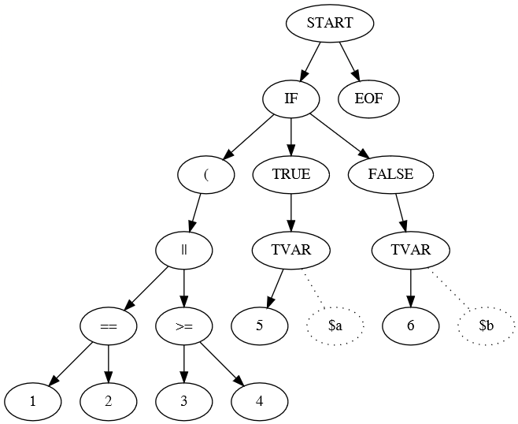
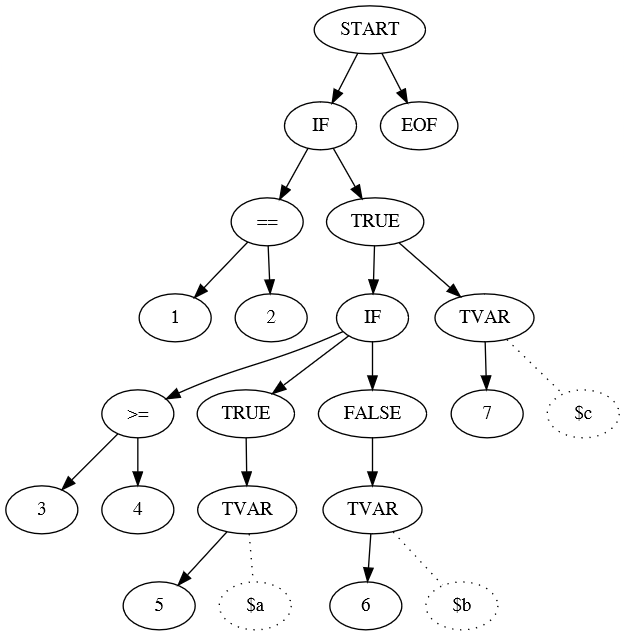

# Rule library

ESP ready, high performant and low resources rules library written in C.

[](https://coveralls.io/github/CurlyMoo/rules?branch=main)[](https://travis-ci.com/CurlyMoo/rules) [](https://opensource.org/licenses/MPL-2.0)[](https://www.paypal.com/cgi-bin/webscr?cmd=_donations&business=info%40pilight%2eorg&lc=US&item_name=curlymoo&no_note=0&currency_code=USD&bn=PP%2dDonationsBF%3abtn_donate_SM%2egif%3aNonHostedGuest)

---
---

## Table of Contents

* [Background](#background)
* [Features](#features)
* [Currently supported platforms](#currently-supported-platforms)
* [Changelog](#changelog)
	 * [Release v1.0](#release-v10)
	 * [Todo](#todo)
* [Prerequisites](#prerequisites)
* [Installation](#installation)
	 * [Linux](#linux)
	 * [Arduino (for ESP)](#arduino-for-esp)
* [Syntax](#syntax)
	 * [If blocks](#if-blocks)
	 * [Nested if blocks](#nested-if-blocks)
	 * [Conditions and math](#conditions-and-math)
	 * [Events](#Events)
	 * [Functions](#functions)
	 * [Body](#body)
	 * [Variables](#variables)
	 * [Parenthesis](#parenthesis)
* [API](#api)
	 * [Providing rules](#providing-rules)
	 * [Modular functions and operators](#modular-functions-and-operators)
	 * [Events](#events)
	 * [Variables](#variables-1)
	 * [Functions &amp; Operators](#functions--operators)
* [Technical reference](#technical-reference)
	 * [Preparing](#preparing)
	 * [Parsing](#parsing)
			* [Nesting](#nesting)
			* [AST structure](#ast-structure)
			* [Node types in bytecode](#node-types-in-bytecode)
			* [Creating and linking nodes](#creating-and-linking-nodes)
	 * [Interpreting](#interpreting)
			* [Jumping back and forth](#jumping-back-and-forth)
			* [Values and variables](#values-and-variables)

---
---

## Background

A rule interpreter can be pretty easily built using a lexer and a parser with techniques like [Shunting Yard](https://en.wikipedia.org/wiki/Shunting-yard_algorithm), a [Recursive Descent Parser](https://en.wikipedia.org/wiki/Recursive_descent_parser), an [Abstract syntax tree](https://en.wikipedia.org/wiki/Abstract_syntax_tree), [Precedence climbing](https://en.wikipedia.org/wiki/Operator-precedence_parser#Precedence_climbing_method) etc.

The downside of all these algoritms are that they - in their common implementation - require techniques not (easily) available on a microcontroller such as the ESP8266 (e.g., recursion, memory alignment), they either require too much memory, too much stack, or are too slow to parse / execute on a microcontroller. This library solves these issues by mixing the core aspects of the theories named above in a custom implementation that does run quickly on microcontollers, but is also very fast on regular enviroments

## Features

- No classic and no tail recursion
- Minimal memory footprint
- Unlimited number of if / else nesting
- Functions
- Operators (with respect of precedence and associativity)
- Variables
- Unlimited nesting of variables, functions, operators and parenthesis
- Unlimited calls to other code blocks
- Modular functions and operators
- Modular callbacks for e.g. implementing global variables
- Bytecode parsing
- ESP8266 and ESP32 ready

---

## Currently supported platforms

1. ESP8266
2. ESP32
3. i386
4. amd64

---
---

## Changelog

### Release v1.0

1. Initial release

### Todo

- String handling in the parser, all operators, and functions
- Float handling in some operators and functions
- Storing values platform independent
- More optimalizations?


## Prerequisites

- Arduino IDE
- ESP8266 Core

---
---

## Installation

### Linux

After cloning this repository from the root folder
```
# mkdir build
# cd build
# cmake ..
# ./start
```

### Arduino (for ESP)

Clone this repository in a folder called `rules`. In this folder:
```
# arduino-cli compile --fqbn esp8266:esp8266:d1 rules.ino
```
Upload the `build\esp8266.esp8266.d1\rules.ino.bin` file to your ESP.

Or open the `rules.ino` in your Arduino GUI.

---
---

## Syntax

This library is looze typed.

### If blocks

If blocks start with a condition defining when either the `if` block should execute or the `else` block should execute. The `else` block is optional. An if / else block always ends with a `end` token. The `elseif` token is not supported.

The body's are not optional. So you can't define an empty `if` / `else` blocks.
```
if [condition] then
  [body]
[else]
  [body]
end
```

### Nested if blocks

The `if` body can contain (multiple) if body's. You can nest an unlimited number of `if` blocks. Each if block should have a accompanied `end` token.

```
if [condition] then
  if [condition] then
     [body]
  [else]
     [body]
  end
[else]
  [body]
end
```

### Conditions and math

Conditions and math are written equally. A number or function are compared or mathematically processed with another number or function.

```
[number | [function] | $variable] [operator] [number | [function] | $variable] [operator] [number | [function] | $variable] ...
```

So
```c
1 + 1 > 5 || 1 + 2 < 6
```

Or
```c
max(1, 2, 3) <= 6 && round(1, 2) > 5
```

Or
```
$a + 5 * $c + max(1, $c)
```

### Event blocks

On blocks are user defined functions or events. A `on` block should be callable from another `on` block or `if` block. The way an `on` block is labeled is customizable. This means the developer implementing this library should define themselves how this label is formatted. The most simple implementation is just using strings as labels. Other ideas are `timer=5` or `@GPIO1`.

`On` blocks cannot be nested inside other `on` blocks or `if` blocks.
```
on [customizable] then
   [body]
end
```

### Functions

A function is written by using the function name followed by at least one opening and closing parenthesis.

```
[string]([arguments], [arguments], ...)
```

When trying to call a defined `on` block a function without arguments is used. the `event call`. E.g.
```
on foo then
   [body]
end

on bar then
   foo();
end
```

Functions can have one or more arguments. Arguments are given inside the parenthesis and are delimited by a `comma`. E.g.
```
max(1, 2, 3);
```
Functions can be nested unlimitedly. E.g.,
```
max(round(0, 12), $hours);
```

### Body

An `if` and `on` body can contain `variables`, `event calls`, `if blocks`. Each statement should end with a semicolon. E.g.:
```
if 1 == 1 then
  if 5 < 6 then
     $a = 1;
     foo();
  else
    $a = 2;
    $b = max(1, 2) * 3;
  end
  $c = 6;
  bar();
  $d = $c + 6 ^ 5;
end
```

### Variables

Variables definitions are customizable. That means just as with `on` labels that what is defined a variable should be implemented by the developer implementing this library. Usefull ideas are `$foo`, `%hour%`, or `@global`.

Variables can be part of a condition or math or used to store a certain value. When storing a value the variable should be followed by an equal sign. After the equal sign the condition or math is placed.

```
$a = $a + max(1, $c);
```

### Parenthesis

Variables can be used in math to prioritize condition above their regular precedence. Variables can allows unlimited nesting.

```
(1 * (1 + 1) / 2) ^ 3
```

## API

### Providing rules

```
int rule_initialize(char **text, struct rules_t ***rules, int *nrrules, void *userdata);
void rules_gc(struct rules_t ***obj, unsigned int nrrules);
int rule_run(struct rules_t *obj, int validate);
```

The first step is to offer rulesets to the `rule_initialize` function. When a rule has been processed, it's removed from the text variable and the text memory block size is decreased therefor freeing memory. This means that as long as the `rule_initialize` function succeeds their are still rules to be parsed inside the ruleset.

```c
while(rule_initialize(&content, &rules, &nrrules, NULL) == 0);
```

The `typedef struct rules_t` array should be declared outside the rule library and it's where all processed rules are stored. The same counts for the `nrrules` integer. That number reflects the number rules already processed.

```c
int rule_run(struct rules_t *obj, int validate);
```

The `rule_run` function is used to execute a specific rule. The validate value should be either one or zero. A one tells the parser to validate the rule (which is already when initializing the rules). Validation means that every part of the rule is reached meaning both the `if` and `else` blocks will be visited.


```c
void rules_gc(struct rules_t ***obj, unsigned int nrrules);
```

The `rules_gc` function clears all rules stored in the `struct rules_t` array.

### Modular functions and operators

As can be read in the syntax description, to fully use this library, a developer should implement their own logic for variables and events. Without this logic, variables and events are not supported.

This also allows the library to interact with the outside world.

*Check the unittests in main.cpp for implementation examples or ask for help in the issues*.

1. Storing the parsed rules is done outside the library. So to call one rule block from another rule block (`events`), the called event needs to looked for in that extarnal rule list.
2. The library only support variables stored into the local scope for the lifetime of the function call. Developers can define their own variables like globals, system variables, hardware parameters.

```
typedef struct rule_options_t {
  /*
   * Identifying callbacks
   */
  int (*is_token_cb)(char *text, int *pos, int size);
  int (*is_event_cb)(char *text, int *pos, int size);

  /*
   * Variables
   */
  unsigned char *(*get_token_val_cb)(struct rules_t *obj, uint16_t token);
  void (*cpy_token_val_cb)(struct rules_t *obj, uint16_t token);
  void (*clr_token_val_cb)(struct rules_t *obj, uint16_t token);
  void (*set_token_val_cb)(struct rules_t *obj, uint16_t token, uint16_t val);
  void (*prt_token_val_cb)(struct rules_t *obj, char *out, int size);

  /*
   * Events
   */
  int (*event_cb)(struct rules_t *obj, char *name);
} rule_options_t;
```

The first two functions are identification functions that help the lexer to identify the different tokens inside the syntax.
- `is_variable` should identify a token as a variable
- `is_event` should identify a token as an event

The functions are called with three parameters:
1. `char *text` contains the original tokenized rule.
2. `int *pos` contains the current location of the lexer in the rule.
3. `int size` the size (number of characters) of the token encountered.

Both functions should return the length of the token found or -1 when the token isn't a variable neither an event.

### Events

The rules library allows the user to define their own functions, greatly reducing redundant code.
```
on foo then
 $a = 1;
 $b = 2;
end

on bar then
  foo();
end
```

The library implements these calls using tail-recursion as followed.

A function call like `foo()` is tokenized as a `TCEVENT` token. E.g. Token which calls a defined event, where the `on` block is labeled as a `TEVENT`. So you have event blocks and event caller functions.

An example:
```c
static int is_event(char *text, int *pos, int size) {
  for(x=0;x<nrrules;x++) {
    if(get_event(rules[x]) > -1) {
      if(strnicmp((char *)&text[*pos], (char *)&rules[x]->ast.buffer[get_event(rules[x])+5], strlen((char *)&rules[x]->ast.buffer[get_event(rules[x])+5])) == 0) {
        return strlen((char *)&rules[x]->ast.buffer[get_event(rules[x])+5]);
      }
    }
  }
  return -1;
}
```

As soon as an event caller function has been reached, the current state of the rule is saved. That means the actual AST step we were in when we called the event and to where we need to return after the event call:

```c
case TCEVENT: {
	struct vm_tcevent_t *node = (struct vm_tcevent_t *)&obj->ast.buffer[go];

	if(rule_options.event_cb == NULL) {
		/* LCOV_EXCL_START*/
		fprintf(stderr, "FATAL: No 'event_cb' set to handle events\n");
		return -1;
		/* LCOV_EXCL_STOP*/
	}

	obj->cont.ret = go;
	obj->cont.go = node->ret;

	/*
	 * Tail recursive
	 */
	return rule_options.event_cb(obj, (char *)node->token);
} break;
```

As soon as the event is done we reached the end of the parser loop (all steps were called). At the end the `event_cb` is called again, but this time without an event name.
```c
/*
 * Tail recursive
 */
if(obj->caller > 0) {
	return rule_options.event_cb(obj, NULL);
}
```

The parser calls the `event_cb` with the name of the event to be called. The callback can be programmed as prefered by the developer implementing this library. My implementation is this:
```
static int event_cb(struct rules_t *obj, char *name) {
  struct rules_t *called = NULL;
  int i = 0, x = 0;

  if(obj->caller > 0 && name == NULL) {
    called = rules[obj->caller-1];

    obj->caller = 0;

    return rule_run(called, 0);
  } else {
    for(x=0;x<nrrules;x++) {
      if(get_event(rules[x]) > -1) {
        if(strnicmp(name, (char *)&rules[x]->ast.buffer[get_event(rules[x])+5], strlen((char *)&rules[x]->ast.buffer[get_event(rules[x])+5])) == 0) {
          called = rules[x];
          break;
        }
      }
      if(called != NULL) {
        break;
      }
    }

    if(called != NULL) {
      called->caller = obj->nr;

      return rule_run(called, 0);
    } else {
      return rule_run(obj, 0);
    }
  }
}
```
So as soon as an event needs to be called, it can be looked for in the rules list. The caller is stored in the called rule so the called rule knows where to go back to. The next time the `event_cb` is called (with the `name = NULL` we can return to the caller rule and continue running it where it left.

```c
case TSTART: {
	struct vm_tstart_t *node = (struct vm_tstart_t *)&obj->ast.buffer[go];
	if(ret > -1) {
		go = -1;
	} else {
		if(obj->cont.go > 0) {
			go = obj->cont.go;
			ret = obj->cont.ret;
			obj->cont.go = 0;
			obj->cont.ret = 0;
		} else {
			vm_clear_values(obj);
			go = node->go;
		}
	}
} break;
```

### Variables

Interaction with variables is always done through the local variable stack of a rule. So, you never interact with values on the AST itself, but with values on the variable stack.

*General*

Working with a variable token is done like this: `(struct vm_tvar_t *)&obj->ast.buffer[token]`.

When the field `value` of the `vm_tvar_t` token is set to zero then the parser knows no value is associated with that variable. Any value other than zero can be used to interact with the variable token. E.g.

```c
struct vm_tvar_t *var = (struct vm_tvar_t *)&obj->ast.buffer[token];
var->value = 0;
```

*Setting*

The set function is used to store a variable or for the developer to use a variable to interact with something else like a single value function call.

1. The `struct rules_t *obj` contains the rule structure as used inside the library.
2. The `uint16_t token` refers to the AST node containing the variable (`struct vm_tvar_t`).
3. The `uint16_t val` refers to the variable position on the variable stack (e.g., `(struct vm_vinteger_t *)&obj->varstack.buffer[val]`).

*Getting*

The get function is meant to retrieve a previously stored variable or to get the value of a system parameter.

1. The `struct rules_t *obj` contains the rule structure as used inside the library.
2. The `uint16_t token` refers to the AST node containing the variable (`struct vm_tvar_t`).

The return value should be a `unsigned char *` pointer to the value on the stack or whatever structure used. The value returned by this function is copied to the local stack so it must be of a valid library token (`vm_vinteger_t`, `vm_vfloat_`, `vm_vnull_t`) with the same structure as these tokens.

*Copying*

The copy function is used to copy a variable value from one variable to another (`$a = 1; $b = $a`).

1. The `struct rules_t *obj` contains the rule structure as used inside the library.
2. The `uint16_t token` refers to the AST node containing the variable (`struct vm_tvar_t`).

*Clearing*

The clearing function can be used to remove a value association to a variable. This function is called to clear all values before a rule is parsed. When you want to enforce a local variable scope, this function allows to the remove all references of the called variables to their respective values.

1. The `struct rules_t *obj` contains the rule structure as used inside the library.
2. The `uint16_t token` refers to the AST node containing the variable (`struct vm_tvar_t`).

*Printing*

The print function is used for debugging purposes. This function can be used to output all stored variables and associated values.

1. The `struct rules_t *obj` contains the rule structure as used inside the library.
2. The `char *out` points to the output buffer.
3. The `int size` contains the size of the output buffer.

### Functions & Operators

Functions are operators are modular. Both are programmed in C just as the libary itself.

When creating a new function or operator it should be added to the `event_functions` or `event_operators` arrays. The structure of the list items are self-explanatory. Each function or operator reside in their own seperate source files.

*Operator*

A operator is formatted with four parameters:

```c
int (*callback)(struct rules_t *obj, int a, int b, int *ret);
```

1. The `struct rules_t *obj` contains the rule structure as used inside the library.
2. The `int a` contains the location of the left hand value of the operator on the value stack.
3. The `int b` contains the location of the left hand value of the operator on the value stack.
4. The `int *ret` contains the location of the new value of the operator on the value stack.

An operator module should return zero if it ran correctly, if it failed, return minus one. A failing operator will trigger an exception on the ESP so should be used carefully. It should be used only in case of fatal programmatic errors.

Getting a value from the value stack is done by first checking the type of the value. The type is always the first byte of the value and that byte is referenced in the locations passed. E.g.:
```c
if(obj->varstack.buffer[a] == VINTEGER) {
   struct vm_vinteger_t *v = (struct vm_vinteger_t *)&obj->varstack.buffer[a];
}
```

Placing a value on the varstack is done by reserving new space for the value by increasing the (aligned) buffer. E.g.:
```c
// Calculate the new space necessary
unsigned int size = alignedbytes(obj->varstack.nrbytes+sizeof(struct vm_vinteger_t));
// Allocate that new space
if((obj->varstack.buffer = (unsigned char *)REALLOC(obj->varstack.buffer, alignedbuffer(size))) == NULL) {
  OUT_OF_MEMORY
}
// Cast that new memory block to the new value type
struct vm_vinteger_t *out = (struct vm_vinteger_t *)&obj->varstack.buffer[obj->varstack.nrbytes];
out->ret = 0;
out->type = VINTEGER;

// Return the new location
*ret = obj->varstack.nrbytes;
```

*Function*

A function is formatted with four parameters:

```c
int (*callback)(struct rules_t *obj, uint16_t argc, uint16_t *argv, int *ret);
```

1. The `struct rules_t *obj` contains the rule structure as used inside the library.
2. The `uint16_t argc ` contains the number of arguments passed.
3. The `uint16_t *argv` contains an array with the locations of the passed variables on the values stack.
4. The `int *ret` contains the location of the new value of the function on the value stack.

An function module should return zero if it ran correctly, if it failed, return minus one. A failing function will trigger an exception on the ESP so should be used carefully. It should be used only in case of fatal programmatic errors.

Working with the value stack is the same as described in the operator modules.

## Technical reference

### Preparing

The first simple step to reduce the processing speed of a rule is to bring it back to its core tokens. When processing syntax, we are constantly processing if a part is a function, a variable, a operator, a number etc. That identification process is relatively slow so it's better to do it only once.

```
if 1 == 1 then $a = max(1, 2); end
```
This rule contains some static tokens like `if`, `then`, `end`, `(`, `)`, `;`, `=`, `,` some factors like `1` and `2`, and some modular or dynamic tokens like `==`, `$a`, `max`. Factors are values we literally need to know about, just as the variable names. The `==` operator and `max` functions can be indexed by their operators and functions list position, the rest can simply be numbered.

That leaves the variable tokens. These need to be stored as literally as they are defined.

First we number the static tokens
1.	  TOPERATOR
2.	  TFUNCTION
3.	  TSTRING
4.	  TNUMBER
5.	  TNUMBER1
6.	  TNUMBER2
7.	  TNUMBER3
8.	  TEOF
9.	  LPAREN
10.	  RPAREN
11.	  TCOMMA
12.	  TIF
13.	  TELSE
14.	  TTHEN
15.	  TEVENT
16.	  TCEVENT
17.	  TEND
18.	  TVAR
19.	  TASSIGN
20.	  TSEMICOLON
21.	  TTRUE
22.	  TFALSE
23.	  TSTART
24.	  VCHAR
25.	  VINTEGER
26.	  VFLOAT
27.	  VNULL

Let's say the `==` operator is the first operator (counted from zero) in the operator list and the `max` function is the second function in the functions list.

So, this rule can be rewritten like this:

```
12 5 1 1 0 5 1 14 18 $ a 19 2 1 9 5 1 11 5 2 10 20 17
```

The prepared rule overwrites the original rule so no new memory needs to be allocated. There are some tricks involved to enable this.

The most easy way to tokenize a syntax is like this, e.g. a number:
```
4 1 5 \0
```

So a token identifier (TNUMBER), the actual number, and a null terminator. The downside to this is that the original number `15` increases from 2 bytes to 4 bytes. Depending on the rule structure this increase of bytes makes it too big to fit in the original rule. The first step is to drop the null terminator. Which saves one byte. But dropping the null terminator removes the cue how many ASCII bytes to read. Therefor three token types are introduced: `TNUMBER1`, `TNUMBER2`, `TNUMBER3`. A `TNUMBER1` token is followed by a number stored in one ASCII byte. A `TNUMBER2` by two ASCII bytes, a `TNUMBER3` by three ASCII bytes. There isn't a `TNUMBER4` because an integer or float is already stored in four bytes.

A similar logic is applied to the variables. No null terminator is used. However, we only use 27 tokens. The allowed variables characters reside in the ASCII 33 to 126 range. This means that an ASCII character before 33 means we've encountered a new token. Therefor, the token identifier is used as a null termator.

The last issue occurs is certain rule syntaxes. E.g.:
```
(1 + 1); end
```
When replacing the syntax with tokens the `1);` sequence is problematic. Sometimes the last number `1` is being overwritten starting from the same byte. This would overwrite the closing parenthesis, since the smallest number replacement is 2 bytes. But, the space between between the semicolon and the `end` rescues us. We can move the closing parenthesis and semicolon one place fixing this issue. Both tokens are replaced taking just one byte, just as the `end` token.

Parsing the rule into an `abstract syntax tree` (AST) replaces each token with a tree node. These tree nodes are just like the lexer tokens of a certain size that can be calculated while reading the syntax. So, when we finish the preperation step, the necessary memory size for the AST is known. This allows for just doing one (aligned) memory allocation and filling that memory block while building the tree. Therefor just one aligned memory block is created as if it were are memory pool, and keep all tree nodes are kept unaligned, saving a lot of space.

### Parsing

The next step is parsing the rule in a programmatic friendly AST.

```
if (1 == 2 || 3 >= 4) then $a = 5; else $b = 6; end
```



So we enter the `if` node. The first branch directs us to the condition. The second branch represents the true body and the last branch represents the false body. To parse the condition we first need to travel downwards to the last nodes and back up again. So we first need to parse `1 == 2`, then `3 >= 4` to be able to parse the `or` condition based on the outcome of the two bottom nodes.

The most easy way to built and execute an AST is by using recursion. The nice thing about an AST built by using recursion is that it allows you to easily process all nested blocks such as nested `if / else` blocks as shown below, nested functions (e.g., `max(random(1, 10), 4)`), parenthesis (e.g., `(1 + 2) * ((4 - 5) ^ (2 * (3 / 4)))`) or a combination of them.

```
if 1 == 2 then
  if 3 >= 4 then
    $a = 5;
  else
    $b = 6;
  end
  $c = 7;
end
```




Building recursion on a non-recursive way requires one of more stacks. Common implementation of recursion using stacks are pretty memory intensive. Using [Tail recursion](https://en.wikipedia.org/wiki/Tail_call) was an option together with [Continuation passing style](https://en.wikipedia.org/wiki/Continuation-passing_style), but you easily wind up lost in the downward and upward traversel of the tree.

#### Nesting

So we want to drop recursion and we want to avoid having to rely on stack calls too much to minic recursion, but somehow we need to deal with these nested calls, which recursion is best fit for.

We have determined that there are three types of blocks that can be nested. Parenthesis, If and Function blocks. To deal with these nested blocks, the parser first parses the rule from to end to the beginning.
```
if ((3 * 2) == 2) || 6 > = 5 then
  if 3 >= 4 then
    $a = 5;
  else
    $b = 6;
  end
  $c = 7;
end
```

In case of this example, the inner `if` block is parsed first and stored in the beginning of our parsed bytecode. Secondly the inner `parenthesis` is parsed, then the outer `parenthesis` which links the already parsed inner `parenthesis` to it. And as last it will link root `if` block.

```
| inner if | inner parenthesis | outer parenthesis | root if |
```

The root `if` block will therefor always be parsed last. If the root `if` encounters the outer `parenthesis`, it links that `parenthesis` and continues where the outer `parenthesis` ended. When the outer `parenthesis` encountered the inner `parenthesis`, it links the inner `parenthesis` and continues where the inner `parenthesis` ended. If the root if encounters the inner `if`, it will link that inner `if` and continues where the inner `if` ended.

The same counts for nested function calls:

```
max(1 * 2, (min(5, 6) + 1) * 6)
```

The parsing order will be:

| min function | inner parenthesis | max function

Where we again start parsing from the most deepest nested token to the most outer nested token and finally from root to end, linking these already prepared inner blocks step by step.

To be able to properly parse these nested blocks, some information about them is registered:
- The type (function, parenthesis or if)
- The absolute start position in the prepared rule
- The absolute end position in the prepared rule
- The absolute bytecode position where the block starts

In the final AST, only the type and the absolute bytecode position of the block are irrelevant. So, we cache these blocks in an independent global cache. As soon as a nested block has been linked to another block, it will be removed from the cache. Leaving an empty cache as soon as all rules have been parsed.

#### AST structure

An AST consists of various different type of nodes. Each node has its own number of elements. The `if` node consists of three elements: condition branch, true branch, false branch. The `true` and `false` node consists of one of more branches, namely the different expressions that needs te be evaluated inside an `then` or `else` block.

Within an AST one node is linked to another node based on the action associated with the specific type of node. An `if` node will jump to the `true` branch if the condition returns boolean true of the `false` branch if the condition returns boolean false.

To jump back and forth between nodes, they are linked by their absolute position in the bytecode.

If we look at the nested function example again, but now expanded with (random) absolute bytecode positions, and the operators.

```
max(1 * 2, (min(5, 6) + 1) * 6)
```

| 1 min function | 6 inner parenthesis | 9 operator | 11 max function | 15 operator | 18 operator |

1. We start at absolute position 11 where the max function resides. 
2. The first argument of this function is an operator so we jump to position 15.
3. Once the operator has been parsed we go back to position 11.
4. The max function sees we returned from position 11 so the first argument has been evaluated.
5. The next argument is a parenthesis block which resides at position 6.
6. The first token in the parenthesis is the function min that resides at position 1.
7. The min function parses both arguments and returns to position 6.
8. The parenthesis knows we returned from position 6 so we go to position 9 to parse the operator.
9. We return to position 6 which know knows all linked blockes have been evaluated so it can return to the max function as position 11.
10. The last token is an operator which multiplies the result of the parenthesis. So from position 11 we jump to position 18 to run the last operator.
11. Then we go back to positiion 11. The max function now sees all arguments are done evaluating so we can evaluate the max function call.

The downside to this nested parsing approach is that the first parsed node isn't necessarily the root `if` node. However, we do know that the root `if` node always needs to start at position 1 of the rule. The very first node inserted in the parsed bit of the bytecode is a `start` node. Because the `start` node is always the first node of the AST it's easily locatable. As soon as the root `if` node is parsed, it links itself to the `start` node, so the interpreter always knows where to start parsing. As soon as the full rules is parsed an `eof` node is created. The `start` will return to the `eof` node. The `eof` node goes nowhere and returns to nowhere. The `eof` node helps the interpreter determine what the last bytes are in the bytecode of the parsed rule.

#### Node types in bytecode

The core of the bytecode AST are one or more jumps forwards and a jump backwards.

So a generic node consists of a `type` byte. This allows us to define 32 different types of tokens and a `return` of bytes. This allows us to jump to a token at the absolute maximum position of around byte 16554. If we need to be able to jump further, the `uint16_t` can be increases to `uint32_t`, but it'll increase the size of the bytecode as well.

```c
#define VM_GENERIC_FIELDS \
  uint8_t type; \
  uint16_t ret;
 ```
 
 The `if` node type will look like this:
 ```c
 typedef struct vm_tif_t {
  VM_GENERIC_FIELDS
  uint16_t go;
  uint16_t true_;
  uint16_t false_;
} vm_tif_t;
```

This shares the *generic* fields, but has three additional ones. A `go` of two bytes to jumps to the root operator, a `true` of two bytes to jump to the `true` node, and a `false` of two bytes to jump to the false node. In the actual code the `if` node is type 9 and takes 9 bytes.

In bytecode this simply looks like this:
```
| 1 | 2  3 | 4  5 | 6  7 | 8  9 |
| 9 | . 12 | . 17 | . 20 | . 26 |
```

To easily read this information we look at the first byte. This tells us the upcoming 8 bytes belong to an `if` node, so we can cast the bytecode to `vm_tif_t` and the appropriate fields will be set:

```c
struct vm_tif_t *node = (struct vm_tif_t *)&rule->bytecode[0];
```

To first store the bytes in the bytecode, we simply make space for the `vm_tif_t` node and assign the empty space to the struct:

```c
rule->bytecode = (unsigned char *)realloc(rule->bytecode, rule->nrbytes+sizeof(struct vm_tif_t));
struct vm_tif_t *node = (struct vm_tif_t *)&rule->bytecode[rule->nrbytes];
node->type = 9;
node->ret = 12;
node->go = 17;
node->true_ = 20;
node->false_ = 26;
rule->nrbytes += sizeof(struct vm_tif_t);
```
This simply adds an `if` node in our bytecode in a developer friendly way. Both are neat standard C functions to deal with bytecode.

Each node has these some generic bytes in common and some specific bytes that store information for the specific node type. However, they all interact similarly with the bytecode in the background. They claim bytecode storage to store their specific bytes, or specific bytes are cast to a specific node type struct to easily read the bytecode information.

Working with bytecode casted to specific struct allows us to change the bytecode structure by simply changing the elements within these structs. E.g. increasing the `uint16_t` to `uint32_t` to allow for further jumps.

#### Creating and linking nodes

The creation and linking of the nodes is where the parses comes in. That tells us if the preprared rule is actually valid.

The parser starts with parsing the nested blocks. When those are done, it will start parsing the root `if` blocks. As you can expect from a parser, it will just walk through the rule and check if the found token was also an expected token.

This library currently consists of a parser for the `if`, `operator`, `variable`, `parenthesis`, and `function` tokens. Whenever a parser of one type jumps to a parser of another type, the new type knows where it came from. So, when we jump from the `if` parser to the `operator` parser, the `operator` parser knows it was called from the `if` parser. And when the `operator` parser rewinds back to the `if` parser, the `if` parser knows it came from the `operator`. Together with this forward and backward jumps the last `step` is communicated. So when we go from `if` block #1 to an operator block #6, the operator can link node #1 to node #6 and can back again. So node #6 knows it's linked to node #1.

Where a recursive parser only walks forward, this non-recursive parser first parses the nestable blocks in the rule from back to front. Then it walks backwards and forward through the AST continuously linking nodes. The only temporary memory we need to allocate are those for the pointers to the nested blocks in the cache. All nodes and branches are just allocated once and directly fit. Which means they don't have to move around when they're parsed. This make the current parser very memory friendly.

### Interpreting

The interpreter is used to interpret the parsed AST. We now know each node tells us where we need to go next or where to return to. The interpreter start with the `start` node. The start node tells the interpreter where to find the root `if` node. When the `start` node was called from the root `if` node, it knows the interpreter was done parsing, so it can go to the `end` node.

#### Jumping back and forth

The `if` node knows it was entered coming from the `start` node. It will go to the root operator first. The root operator is linked to the rest of the operators, factors, and/or parenthesis and/or functions making the full condition. As soon as the root operator is done evaluating, it returns to the calling `if` node. The `if` node now knows it was called from an operator. No need to go back to the operator again. Instead, based on the return value of the operator it calls the `true` node or the `false` node.

The `true` or `false` nodes start going to the first node of the linked expression list. These expressions parse and go back to the calling `true` or `false` node. The `true` and `false` nodes know from which expression the nodes where called. It loops through the expression list again to look for the expression next to the one it was called from.

The interpreter is nothing more than these jumps back and forth.

#### Values and variables

Until this point everything is static, while we also have dynamic values like variables and the outcome of operators and functions.
```c
1 == 0 || 5 >= 4
```
To be able to parse the `||` operator it needs to know what the outcome is of the `1 == 0` and `5 >= 4` evaluations. The interpreter stores the intermediate values on a seperate value stack. These values are stored in the same way as the node types. By using a seperate stack, we just reallocate a small memory block in each interpretation, preventing memory fragmentation.
```c
typedef struct vm_vinteger_t {
  VM_GENERIC_FIELDS
  int value;
} vm_vinteger_t;
```

Each value uses the generic fields `type` and `ret`, with an additional specific `value` field of the specific type (in this case int). In this libary, `vinteger` is of type 20. So the first byte has the value 20.
```
|  1 |  2  3 |  4  5 |  6  7 |  8  9 | 10 11 |
| 20 |  .  4 |  .  . |  .  . |  .  . |  .  5 |
```
The next two bytes tells us to what token the value was linked. The next four bytes store the integer value. Each value (float, integer and char) are represented in structs which again are stored in the bytecode.

In the previous condition the `1 == 0` outcome is stored in an integer on the values stack. The integer value is associated to the `==` operator and the operator to the integer value. The same counts for the `5 >= 4` operator. When the `||` is called, it pops the outcome values from the left and right operator from the value stack, and places the outcome back on the stack. When the operator was called from an `if` node, the `if` node pops the value from the stack and uses it to determine if we need to continue to the `true` node or the `false` node.

```c
$a = 1;
$b = $a;
```
In this case, the integer value 1 is stored on the stack and associated to the `variable` token. When the value of `$a` is stored in `$b` the association of the value is just changed from `$a` to `$b` instead of popping the value from the stack, realigning all subsequent values on the stack, and inserting it again.