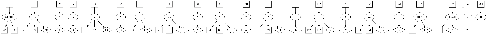

# Rule library

ESP ready, high performant and low resources rules library written in C.

[](https://coveralls.io/github/CurlyMoo/rules?branch=main)
[]()
[]()
[]()
[]()
[](https://opensource.org/licenses/MPL-2.0)  [](https://www.paypal.com/cgi-bin/webscr?cmd=_donations&business=info%40pilight%2eorg&lc=US&item_name=curlymoo&no_note=0&currency_code=USD&bn=PP%2dDonationsBF%3abtn_donate_SM%2egif%3aNonHostedGuest)

---
---

## Table of Contents

* [Background](#background)
* [Features](#features)
* [Currently supported platforms](#currently-supported-platforms)
* [Changelog](#changelog)
	 * [Release v1.0](#release-v10)
	 * [Todo](#todo)
* [Prerequisites](#prerequisites)
* [Installation](#installation)
	 * [Linux](#linux)
	 * [Arduino (for ESP)](#arduino-for-esp)
	 * [In your (Arduino) project](#in-your-arduino-project)
* [Syntax](#syntax)
	 * [If blocks](#if-blocks)
	 * [Nested if blocks](#nested-if-blocks)
	 * [Conditions and math](#conditions-and-math)
	 * [Event blocks](#event-blocks)
	 * [Functions](#functions)
	 * [Body](#body)
	 * [Variables](#variables)
	 * [Parenthesis](#parenthesis)
* [API](#api)
	 * [Providing rules](#providing-rules)
	 * [Modular functions and operators](#modular-functions-and-operators)
	 * [Events](#events)
	 * [Variables](#variables-1)
	 * [Functions &amp; Operators](#functions--operators)
* [Technical reference](#technical-reference)
	 * [Preparing](#preparing)
	 * [Parsing](#parsing)
			* [Nesting](#nesting)
			* [AST structure](#ast-structure)
			* [Node types in bytecode](#node-types-in-bytecode)
			* [Creating and linking nodes](#creating-and-linking-nodes)
	 * [Interpreting](#interpreting)
			* [Jumping back and forth](#jumping-back-and-forth)
			* [Values and variables](#values-and-variables)
	 * [2nd heap](#2nd-heap)

---
---

## Background

A rule interpreter can be pretty easily built using a lexer and a parser with techniques like [Shunting Yard](https://en.wikipedia.org/wiki/Shunting-yard_algorithm), a [Recursive Descent Parser](https://en.wikipedia.org/wiki/Recursive_descent_parser), an [Abstract syntax tree](https://en.wikipedia.org/wiki/Abstract_syntax_tree), [Precedence climbing](https://en.wikipedia.org/wiki/Operator-precedence_parser#Precedence_climbing_method) etc.

The downside of all these algoritms are that they - in their common implementation - require techniques not (easily) available on a microcontroller such as the ESP8266 (e.g., recursion, memory alignment), they either require too much memory, too much stack, or are too slow to parse / execute on a microcontroller. This library solves these issues by mixing the core aspects of the theories named above in a custom implementation that does run quickly on microcontollers, but is also very fast on regular enviroments.

## Features

- No classic, but only tail recursion
- Mempool usage; minimal memory footprint and minimal fragmentation
- Unlimited number of if / else nesting
- Functions
- Operators (with respect of precedence and associativity)
- Variables
- Unlimited nesting of variables, functions, operators and parenthesis
- Unlimited calls to other code blocks
- Modular functions and operators
- Modular callbacks for e.g. implementing global variables
- Bytecode parsing
- ESP8266 and ESP32 ready
- ESP8266 runs in the 2nd heap (fast and safe mode)
- Allows running rules fully async

When properly configured the 2nd heap can give you 16KB mempool which can be fully used as dedicated memory for the rule parser. This leaves the normal memory for the core program. Because the 2nd heap is used as a mempool it also prevents memory fragmentation.

---

## Currently supported platforms

1. ESP8266
2. ESP32
3. i386
4. amd64

---
---

## Changelog

### Release v1.0

1. Initial release

### Todo

- String handling in the parser, all operators, and functions
- Storing values platform independent
- More optimalizations?

## Prerequisites

- Arduino IDE
- ESP8266 Core

---
---

## Installation

### Linux

After cloning this repository from the root folder
```
# mkdir build
# cd build
# cmake ..
# ./start
```

### Arduino (for ESP)

Clone this repository in a folder called `rules`. In this folder:
```
# arduino-cli compile --fqbn esp8266:esp8266:d1 rules.ino
```
Upload the `build\esp8266.esp8266.d1\rules.ino.bin` file to your ESP.

Or open the `rules.ino` in your Arduino GUI.

### In your (Arduino) project

1. Move the full `src` folder into your project root.
2. Include the `#include "src/rules/rules.h"` header.
3. Configure the rules API as described below.
4. Parse your rules as described below.

---
---

## Syntax

This library is looze typed.

### If blocks

If blocks start with a condition defining when either the `if` block should execute or the `else` block should execute. The `else` block is optional. An if / else block always ends with a `end` token.

The body's are not optional. So you can't define an empty `if` / `else` blocks.
```
if [condition] then
  [body]
[else]
  [body]
end
```

The syntax also supports `elseif` statements.
```
if [condition] then
  [body]
[elseif] [condition] [then]
  [body]
[else]
  [body]
end
```

### Nested if blocks

The `if` body can contain (multiple) if body's. You can nest an unlimited number of `if` blocks. Each if block should have a accompanied `end` token.

```
if [condition] then
  if [condition] then
     [body]
  [else]
     [body]
  end
[else]
  [body]
end
```

### Conditions and math

Conditions and math are written equally. A number or function are compared or mathematically processed with another number or function.

```
[number | [function] | $variable] [operator] [number | [function] | $variable] [operator] [number | [function] | $variable] ...
```

So
```ruby
1 + 1 > 5 || 1 + 2 < 6
```

Or
```ruby
max(1, 2, 3) <= 6 && round(1, 2) > 5
```

Or
```ruby
$a + 5 * $c + max(1, $c)
```

### Event blocks

On blocks are user defined functions or events. A `on` block should be callable from another `on` block or `if` block. The way an `on` block is labeled is customizable. This means the developer implementing this library should define themselves how this label is formatted. The most simple implementation is just using strings as labels. Other ideas are `timer=5` or `@GPIO1`.

`On` blocks cannot be nested inside other `on` blocks or `if` blocks.
```
on [customizable] then
   [body]
end
```

### Functions

A function is written by using the function name followed by at least one opening and closing parenthesis.

```
[string]([arguments], [arguments], ...)
```

When trying to call a defined `on` block a function without arguments is used. E.g.
```ruby
on foo then
   [body]
end

on bar then
   foo();
end
```

Functions can have one or more arguments. Arguments are given inside the parenthesis and are delimited by a `comma`. E.g.
```ruby
max(1, 2, 3);
```
Functions can be nested unlimitedly. E.g.,
```ruby
max(round(0, 12), $hours);
```

### Body

An `if` and `on` body can contain `variables`, `event calls`, `if blocks`. Each statement should end with a semicolon. E.g.:
```ruby
if 1 == 1 then
  if 5 < 6 then
     $a = 1;
     foo();
  else
    $a = 2;
    $b = max(1, 2) * 3;
  end
  $c = 6;
  bar();
  $d = $c + 6 ^ 5;
end
```

### Variables

Variables definitions are customizable. That means just as with `on` labels that what is defined a variable should be implemented by the developer implementing this library. Usefull ideas are `$foo`, `%hour%`, or `@global`.

Variables can be part of a condition or math or used to store a certain value. When storing a value the variable should be followed by an equal sign. After the equal sign the condition or math is placed.

```ruby
$a = $a + max(1, $c);
```

### Parenthesis

Variables can be used in math to prioritize condition above their regular precedence. Variables can allows unlimited nesting.

```ruby
(1 * (1 + 1) / 2) ^ 3
```

## API

### Providing rules

```c
int8_t rule_initialize(struct pbuf *input, struct rules_t ***rules, uint8_t *nrrules, struct pbuf *mempool, void *userdata);
```

The first step is to offer rulesets to the `rule_initialize` function. The `input.payload` value should link to an individual rule block. The `input.len` will be updated to point to the beginning of the next rule block. You can use the `input.len` value to point to the new rule block which again should be assigned to the `input.payload` value. This should be repeated while the `rule_initialize` returns `0`.

The mempool parameter should link to a dedicated block of memory assigned to a `pbuf` struct. On the ESP8266, the mempool can reside in either the 1st or 2nd heap. Because (almost) everything takes place inside the mempool, hardly no additional memory needs to be allocated preventing memory fragmentation.

You can use the userdata parameter to implement local and or global variables. In case of implementing a global rulestack, it is adviced to use the `struct rule_stack_t` just like the library uses itself. This allows you to use the helper functions provides with this library.

The `typedef struct rules_t` array should be declared outside the rule library and it's where all processed rules are stored. The same counts for the `nrrules` integer. That number reflects the number rules already processed.

**Example**

Let's say the full rule set is saved in the `text` function and a 2nd heap is used. An example on how this could be implemented. Check the examples and unittest on how to implement variables and events.

```c
/* Global vars */

/*
 * All individually parsed rules reside in
 * the rules_t struct array. This struct
 * fully lives inside the mempool.
 */
static struct rules_t **rules = NULL;
/*
 * The number of rules parsed.
 */
static int nrrules = 0;

/*
 * MMU_SEC_HEAP_SIZE are MMU_SEC_HEAP are
 * special defines for the ESP8266 when
 * using the 2nd heap. In this example the
 * full 2nd heap is used.
 */
#define MEMPOOL_SIZE MMU_SEC_HEAP_SIZE
unsigned char *mempool = (unsigned char *)MMU_SEC_HEAP;

/* Inside function */

/*
 * The pbuf struct that contains all info
 * for the rules library to interface with
 * the mempool and rulesets.
 */
struct pbuf mem;
struct pbuf input;

mem.payload = mempool;
mem.len = 0;
mem.tot_len = MEMPOOL_SIZE;

/*
 * The text variable is just a string
 * containing the ruleset.
 */
input.payload = &text[0];
input.len = 0;
input.tot_len = strlen(text);

int ret = 0;
while((ret = rule_initialize(&input, &rules, &nrrules, &mem, NULL)) == 0) {
  input.payload = &text[input.len];
}
```

A tip is to place the raw ruleset string at the end of the mempool. As soon as a rule block has been parsed from within the rule set it's no longer needed so it can be overwritten by the rule parser. Hardly no overhead is needed for this kind or parsing.

```c
int8_t rules_loop(struct rules_t **rules, uint8_t nrrules, uint8_t *nr);
```

The `rule_loop` function is used to (a)sync execute rule blocks. The `nr` argument returns the rule number currently being executed. This function will return `-1` when an error occured, `-2` when there are no rules listed for execution, `0` when a rule is done executing, and `1` when there is a rule being executed.

```c
int8_t rule_call(uint8_t nr);
```

To enlist a rule for execution, this function can be called with the rule nr that should be enqueued for execution. If the execution queue is full, this function returns `-1`. When enqueuing was succesfull it will return `0`.

```c
int8_t rule_token(struct rule_stack_t *obj, uint16_t pos, unsigned char *out, uint16_t *size);
```

The `rule_token` function is a helper function to make it easier to interface with the rule stack and to deal with all quirks associated with the 2nd heap on the ESP8266. The first parameter should contain the rule stack. For an individual rule this is the `varstack` field of the `rules_t` struct. The second parameter `pos` should point to a position on the stack. The `out` parameter should contain a pre-allocated block of memory. The `pos` value is passed by the library to the different (relevant) `rule_options_t` functions described below. To determine to necessary memory size for the `out` parameter, this function can be called with `NULL` as the `out` parameter. Parameter `size` shall be updated with the necessary size. If the function was called with the `out` parameter allocated but with a `size` parameter too small, the function will return with `-2` and a `size` parameter with the required memory size. The function will return `-1` in case of an error.

In this case, a rule stack was placed in the rule userdata field.

```c
struct rule_stack_t *varstack = (struct rule_stack_t *)obj->userdata;

unsigned char *out = NULL;
uint16_t s_out = 0;
int8_t ret = 0;

// Determine the necessary memory size
ret = rule_token(&obj->ast, token, NULL, &s_out);
if(ret == -1) {
  // A definite failure
	return NULL;
}
if(ret == -2) {
	// Allocate the necessary memory
	out = (unsigned char *)realloc(out, s_out);
	memset(out, 0, s_out);

	// Actually fill the out parameter
	if(rule_token(&obj->ast, token, &out, &s_out) < 0) {
		// If it still fails with either -1 or -2
		// the function will not succeed either way
		return NULL;
	}
}

if(out[0] == TVALUE) {
  struct vm_tvalue_t *val = (struct vm_tvalue_t *)out;
	[...]
}
```

### Modular functions and operators

As can be read in the syntax description, to fully use this library, a developers should implement their own logic for variables and events. Without this logic, variables and events are not supported.

This also allows the library to interact with the outside world.

*Check the unittests in main.cpp for implementation examples or ask for help in the issues*.

1. Storing the parsed rules is done outside the library. So to call one rule block from another rule block (`events`), the called event needs to looked for in that extarnal rule array.
2. The library only support variables stored into the local scope for the lifetime of the function call. Developers can define their own variables like globals, system variables, hardware parameters.

```c
typedef struct rule_options_t {
  /*
   * Identifying callbacks
   */
  int8_t (*is_token_cb)(char *text, uint16_t size);
  int8_t (*is_event_cb)(char *text, uint16_t *pos, uint16_t size);

  /*
   * Variables
   */
  unsigned char *(*get_token_val_cb)(struct rules_t *obj, uint16_t token);
  int8_t (*clr_token_val_cb)(struct rules_t *obj, uint16_t token);
  int8_t (*set_token_val_cb)(struct rules_t *obj, uint16_t token, uint16_t val);
  void (*prt_token_val_cb)(struct rules_t *obj, char *out, uint16_t size);

  /*
   * Events
   */
  int8_t (*event_cb)(struct rules_t *obj, char *name);
} rule_options_t;
```

The first two functions are identification functions that help the rule parser to identify the different tokens inside the syntax.
- `is_variable` should identify a token as a variable
- `is_event` should identify a token as an event

The `is_variable` function is called with two parameters:
1. `char *text` contains the name of the token encountered, possibly a variable name.
2. `uint16_t size` the size (number of characters) of the token encountered.

The `is_event` function is called with three parameters:
1. `char *text` contains the rule block currently being prepared.
2. `uint16_t pos` contains the position inside the rule block where a token was encountered, possible an event.
3. `uint16_t size` the size (number of characters) of the token encountered.

Both function should return a `-1` when the token isn't a variable neither an event. The `is_variable` function should return the length of the token found. The `is_event` should return `0` when a token was indeed an event.

### Events

The rules library allows the user to define their own functions, greatly reducing redundant code.
```ruby
on foo then
 $a = 1;
 $b = 2;
end

on bar then
  foo();
end
```

The library implements these calls using tail-recursion as follows.

A function call like `foo()` is tokenized as a `TCEVENT` token. So a token which calls a defined event, where the `on` block is labeled as a `TEVENT`. So you have event blocks and event caller functions. Since this ruleset only contains two rule blocks the `on foo then` block is the first rule block in the `rules_t` array and `on bar then` the second.

```
static int8_t event_cb(struct rules_t *obj, char *name);
```

The `event_cb` function is used to find the rule being called by another rule. A special helper function `rule_by_name` can be used to locate the rule to be called. The rule library will do the rest. The `go` field of the `ctx` struct is a pointer to the to be called rule. The `ret` field is a pointer to the rule where the called rule was called from.

```c
static int8_t event_cb(struct rules_t *obj, char *name) {
  int8_t nr = rule_by_name(rules, nrrules, name);
  if(nr == -1) {
    return -1;
  }

  obj->ctx.go = rules[nr];
  rules[nr]->ctx.ret = obj;

  return 1;
}
```

Return 1 if you want to continue executing the rule block, return 0 when it should end here and return -1 when an error occured.

### Variables

Interaction with variables is always done through the local variable stack of a rule. So, you never interact with values on the AST itself, but with values on the variable stack. Properly implementing these functions can be quite a burden. Please refer to the unittest example for inspiration on how this is implemented.

Each variable consists of the variable token itself and a value token. The value token points to the actual value on the value stack. The value token also stores the name of the value. E.g.: `$a`. This has two advantages. The actual name of the variable only has to be stored once. And there is no need to backlink to each variable that might point to the same value. So, changing the values for all `$a` tokens is done in one spot.

*General*

Working with a variable token is done like this: `(struct vm_tvalue_t *)&obj->ast.buffer[token]`.

When the field `go` of the `vm_tvalue_t` token is set to zero then the parser knows no value is associated with that value (and therefor variable). Any value other than zero can be used to interact with the variable token. E.g.

```c
struct vm_tvalue_t *val = (struct vm_tvalue_t*)&obj->ast.buffer[token];
val->go = 0;
```

*Setting*

The set function is used to store a variable or for the developer to use a variable to interact with something else like a single value function call.

1. The `struct rules_t *obj` contains the rule structure as used inside the library.
2. The `uint16_t token` point to a position on the AST where the variable node can be found (`struct vm_tvalue_t`).
3. The `uint16_t val` refers to the variable position on the variable stack (e.g., `(struct vm_vinteger_t *)&obj->varstack.buffer[val]`).

*Getting*

The get function is meant to retrieve a previously stored variable or to get the value of a system parameter.

1. The `struct rules_t *obj` contains the rule structure as used inside the library.
2. The `uint16_t token` refers to the AST node containing the variable (`struct vm_tvalue_t`).

The return value should be a `unsigned char *` pointer to the value on the stack or whatever structure used. The value returned by this function is copied to the local stack so it must be of a valid library token (`vm_vinteger_t`, `vm_vfloat_`, `vm_vnull_t`) with the same structure as these tokens.

*Clearing*

The clearing function can be used to remove a value association to a variable. This function is called to clear all values before a rule is parsed. When you want to enforce a local variable scope, this function allows to the remove all references of the called variables to their respective values.

1. The `struct rules_t *obj` contains the rule structure as used inside the library.
2. The `uint16_t token` refers to the AST node containing the variable (`struct vm_tvalue_t`).

*Printing*

The print function is used for debugging purposes. This function can be used to output all stored variables and associated values.

1. The `struct rules_t *obj` contains the rule structure as used inside the library.
2. The `char *out` points to the output buffer.
3. The `int size` contains the size of the output buffer.

### Functions & Operators

Functions are operators are modular. Both are programmed in C just as the libary itself.

When creating a new function or operator it should be added to the `rule_functions` or `rule_operators` arrays. The structure of the list items are self-explanatory. Each function or operator reside in their own seperate source files.

*Operator*

A operator is formatted with four parameters:

```c
int8_t (*callback)(struct rules_t *obj, uint16_t a, uint16_t b, uint16_t *ret);
```

1. The `struct rules_t *obj` contains the rule structure as used inside the library.
2. The `uint16_t a` contains the location of the left hand value of the operator on the value stack.
3. The `uint16_t b` contains the location of the right hand value of the operator on the value stack.
4. The `uint16_t *ret` the location of the outcome value of the operator on the value stack.

An operator module should return zero if it ran correctly, if it failed, return minus one. A failing operator will trigger an exception on the ESP so should be used carefully. It should be used only in case of fatal programmatic errors.

```c
int8_t rule_stack_pull(struct rule_stack_t *stack, uint16_t idx, unsigned char val[MAX_VARSTACK_NODE_SIZE+1]);
```

1. The `struct rule_stack_t *stack` contains the stack to work with.
2. The `uint16_t idx` contains the location of the variable in the stack.
3. The `uint16_t val` contains the placeholder to copy the variable on the stack to.

Getting a value on the varstack can be done using the `rule_stack_pull` helper function. This helps you to not have to deal with the 2nd heap and such specifics. Best is to create temporary `unsigned char` variable with at least `MAX_VARSTACK_NODE_SIZE+1`. By passing the varstack to the `stack` parameter and the position on the varstack to the `idx` parameter, the `rule_stack_pull` will store the variable struct on the varstack in the `val` parameter. The return value of this function is either 0 when a value was found and a -1 when it wasn't.

The variables placed in the `val` parameter will be of either `vm_vinteger_t`, `vm_vfloat_t` or `vm_vnull_t`.

So, inside a operation function getting both variables for the operation is done like this:
```c
  unsigned char nodeA[MAX_VARSTACK_NODE_SIZE+1], nodeB[MAX_VARSTACK_NODE_SIZE+1];
  rule_stack_pull(&obj->varstack, a, nodeA);
  rule_stack_pull(&obj->varstack, b, nodeB);
```

Placing a value on the varstack is done by using the helper function `rule_stack_push`.

```c
uint16_t rule_stack_push(struct rule_stack_t *stack, void *in);
```

1. The `struct rule_stack_t *stack` contains the stack to work with.
2. The `void *in` contains a `unsigned char` array containing the variable to be place on the stack.

The variables placed in the `in` parameter need to be of either `vm_vinteger_t`, `vm_vfloat_t` or `vm_vnull_t`.

This functions returns to position where the new variable was placed on the varstack. This position should be saved in the `*ret` parameter of the operator module.

*Function*

A function is formatted with four parameters:

```c
int8_t (*callback)(struct rules_t *obj, uint16_t argc, uint16_t *argv, uint16_t *ret);
```

1. The `struct rules_t *obj` contains the rule structure as used inside the library.
2. The `uint16_t argc ` contains the number of arguments passed.
3. The `uint16_t *argv` contains an array with the locations of the passed variables on the values stack.
4. The `uint16_t *ret` the location of the outcome value of the function on the value stack.

An function module should return `0` if it ran correctly, if it failed, return `-1`. A failing function will trigger an exception on the ESP so should be used carefully. It should be used only in case of fatal programmatic errors.

Working with the value stack is the same as described in the operator modules.

## Technical reference

### Preparing

The first simple step to reduce the processing speed of a rule is to bring it back to its core tokens. When processing syntax, we are constantly processing if a part is a function, a variable, an operator, a number etc. That identification process is relatively slow so it's better to do it only once.

```ruby
if 1 == 1 then $a = max(1, 2); end
```

This rule contains some static tokens like `if`, `then`, `end`, `(`, `)`, `;`, `=`, `,` some factors like `1` and `2`, and some modular or dynamic tokens like `==`, `$a`, `max`. Factors are values we literally need to know about, just as the variable names. The `==` operator and `max` functions can be indexed by their operators and functions list position, the rest can simply be numbered.

That leaves the variable tokens. These need to be stored exactly as they are defined.

First we number the static tokens
1.	  TOPERATOR
2.	  TFUNCTION
3.	  TSTRING
4.	  TNUMBER
5.	  TNUMBER1
6.	  TNUMBER2
7.	  TNUMBER3
8.	  TEOF
9.	  LPAREN
10.	  RPAREN
11.	  TCOMMA
12.	  TIF
13.	  TELSE
14.   TELSEIF
15.	  TTHEN
16.	  TEVENT
17.	  TCEVENT
18.	  TEND
19.	  TVAR
20.	  TASSIGN
21.	  TSEMICOLON
22.	  TTRUE
23.	  TFALSE
24.	  TSTART
25.	  TVALUE
26.	  VCHAR
27.	  VINTEGER
28.	  VFLOAT
29.	  VNULL

Let's say the `==` operator is the first operator (counted from zero) in the operator list and the `max` function is the second function in the functions list. Then this rule can be rewritten like this:

```
12 5 1 1 0 5 1 15 19 $ a 20 2 1 9 5 1 11 5 2 10 21 18
```

The prepared rule overwrites the original rule so no new memory needs to be allocated. There are some tricks involved to enable this.

The most easy way to tokenize a syntax is like this, e.g. a number:
```
4 1 5 \0
```

So a token identifier (TNUMBER), the actual number, and a null terminator. The downside to this is that the original number `15` increases from 2 bytes to 4 bytes. Depending on the rule structure this increase of bytes makes it too big to fit in the original rule. The first step is to drop the null terminator. Which saves one byte. But dropping the null terminator removes the cue how many ASCII bytes to read. Therefor three token types are introduced: `TNUMBER1`, `TNUMBER2`, `TNUMBER3`. A `TNUMBER1` token is followed by a number stored in one ASCII byte. A `TNUMBER2` by two ASCII bytes, a `TNUMBER3` by three ASCII bytes. There isn't a `TNUMBER4` because an integer or float is already stored in four bytes.

A similar logic is applied to the variables. No null terminator is used. However, we only use 28 tokens. The allowed variables characters reside in the ASCII 33 to 126 range. This means that any ASCII character before 33 must be a token. Therefor, the token identifier is used as a null termator.

The last issue occurs is certain rule syntaxes. E.g.:
```ruby
(1 + 1); end
```
When replacing the syntax with tokens the `1);` sequence is problematic. Sometimes the last number `1` is being overwritten starting from the same byte. This would overwrite the closing parenthesis, since the smallest number replacement is 2 bytes. But, the space between between the semicolon and the `end` rescues us. We can move the closing parenthesis and semicolon one place fixing this issue. Both tokens are replaced taking just one byte, just as the `end` token.

Parsing the rule into an `abstract syntax tree` (AST) replaces each token with a tree node. These tree nodes are just like the lexer tokens of a certain size that can be calculated while reading the syntax. So, when we finish the preperation step, the necessary memory size for the AST is known.

### Parsing

The next step is parsing the rule in a programmatic friendly AST.

```ruby
if (1 == 2 || 3 >= 4) then $a = 5; else $b = 6; end
```


So we enter the `if` node. The first branch directs us to the condition. The second branch represents the true body and the last branch represents the false body. To parse the condition we first need to travel downwards to the last nodes and back up again. So we first need to parse `1 == 2`, then `3 >= 4` to be able to parse the `or` condition based on the outcome of the two bottom nodes.

The most easy way to built and execute an AST is by using recursion. The nice thing about an AST built by using recursion is that it allows you to easily process all nested blocks such as nested `if / else` blocks as shown below, nested functions (e.g., `max(random(1, 10), 4)`), parenthesis (e.g., `(1 + 2) * ((4 - 5) ^ (2 * (3 / 4)))`) or a combination of them.

```ruby
if 1 == 2 then
  if 3 >= 4 then
    $a = 5;
  else
    $b = 6;
  end
  $c = 7;
end
```


Building recursion on a non-recursive way requires one of more stacks. Common implementation of recursion using stacks are pretty memory intensive. Using [Tail recursion](https://en.wikipedia.org/wiki/Tail_call) was an option together with [Continuation passing style](https://en.wikipedia.org/wiki/Continuation-passing_style), but you easily wind up lost in the downward and upward traversel of the tree.

#### Nesting

So we want to drop recursion and we want to avoid having to rely on stack calls too much to minic recursion, but somehow we need to deal with these nested calls, which recursion is best fit for.

We have determined that there are three types of blocks that can be nested. `Parenthesis`, `If` and `Function` blocks. To deal with these nested blocks, the parser first parses the rule from to end to the beginning.
```ruby
if ((3 * 2) == 2) || 6 > = 5 then
  if 3 >= 4 then
    $a = 5;
  else
    $b = 6;
  end
  $c = 7;
end
```

In case of this example, the inner `if` block is parsed first and stored in the beginning of our parsed bytecode. Secondly the inner `parenthesis` is parsed, then the outer `parenthesis` which links the already parsed inner `parenthesis` to it. And as last it will link root `if` block.

```
| inner if | inner parenthesis | outer parenthesis | root if |
```

The root `if` block will therefor always be parsed last. If the root `if` encounters the outer `parenthesis`, it links that `parenthesis` and continues where the outer `parenthesis` ended. When the outer `parenthesis` encountered the inner `parenthesis`, it links the inner `parenthesis` and continues where the inner `parenthesis` ended. If the root if encounters the inner `if`, it will link that inner `if` and continues where the inner `if` ended.

The same counts for nested function calls:

```ruby
max(1 * 2, (min(5, 6) + 1) * 6)
```

The parsing order will be:

```
| min function | inner parenthesis | max function
```

Where we again start parsing from the most deepest nested token to the most outer nested token and finally from root to end, linking these already prepared inner blocks step by step.

To be able to properly parse these nested blocks, some information about them is registered:
- The type (function, parenthesis or if)
- The absolute start position in the prepared rule
- The absolute end position in the prepared rule
- The absolute bytecode position where the block starts

In the final AST, only the type and the absolute bytecode position of the block are relevant. So, we cache these blocks in an independent global cache. As soon as a nested block has been linked to another block, it will be removed from the cache. Leaving an empty cache as soon as all rules have been parsed.

#### AST structure

An AST consists of various different type of nodes. Each node has its own number of elements. The `if` node consists of three elements: condition branch, true branch, false branch. The `true` and `false` node consists of one of more branches, namely the different expressions that needs te be evaluated inside an `then` or `else` block.

Within an AST one node is linked to another node based on the action associated with the specific type of node. An `if` node will jump to the `true` branch if the condition returns boolean true of the `false` branch if the condition returns boolean false.

To jump back and forth between nodes, they are linked by their absolute position in the bytecode.

If we look at a new nested function and operators example.

```ruby
if 1 == 1 then $a = max(1 * 2, (min(5, 6) + 1) * 6); end
```

This translates to the following AST but now printed in a different view.



The to squares refer to position inside the AST, which are literally positions in an bytecode array. The bottom square shows the goto posiitons and the diamonds are return to positions. In each oval you can find the type of token that is resembled.

Let's loop through this new AST step by step and we always start at position 0:

- 0: A TSTART token of which the second branch tells us to go to position 132 for the root TIF.
- 132: The TIF is placed at position 132, because because of the nested parsing. The TIF was the toplevel code block so it's parsed last. The first TIF branch tells us to go to 152 to find the condition.
- 152: This represents an `==` condition with on the left hand the first TNUMBER at position 144 to compare with the TNUMBER at position 164. Both TNUMBERs tells us to go back to the operator at 152 to continue parsing the condition.
- 152: The condition evaluates to true so it goes back to the TIF at 132 with that result.
- 132: The TIF knows the condition evaluates to true therefor continueing to position 172 where the TTRUE block resides. In this example there is no TFALSE block.
- 172: The TTRUE block only has one expression to parse and that is the TVAR assignment at position 184.
- 184: The TVAR token points to the TVALUE token which contains the variable name `$a` and holds the pointer to the actual variable on the variable stack.
- 192: The TVALUE is assigned the result of the TFUNCTION at position 68 and links directly to the TVAR token. From the TVAR token we jump a long way back because the nested TFUNCTIONS where parsed before the nested TIF blocks.
- 68: The toplevel TFUNCTION is `max`. This function has two parameter. The first parameter can be found at position 92 where the `*` operator can be found.
- 92: The TOPERATOR first looks for the left hand number at 84 and then the right hand number at 104. When it's done it returns the output back to the TFUNCTION at position 68.
- 68: The next parameter of the TFUNCTION `max` is the second TOPERATOR which is found at 112. This again parses the left hand and the right hand side, but in this case the right hand side goes to the TLPAREN at 60. Parenthesis blocks are prioritized so they are evaluated first. As you can see we continue to move downwards.
- 60: The LPAREN links to the TOPERATOR `+`. This links to the TFUNCTION `min` at 8 which in this case was the first TOKEN parsed.
- 8: The TFUNCTION `min` looks for the first argument at 24 and the second at position 32. Both return to the TFUNCTION `min` at 8. When the TFUNCTION is done collecting its parameters it returns with its result to in this case the TOPERATOR at 40.
- 40: The TOPERATOR `+` adds both the TFUNCTION `min` result and the TNUMBER `1` at 52. When it's done parsing it returns with its results to the LPAREN at 60.
- 60: The LPAREN returns with the result to the TOPERATOR at 112.
- 112: The TOPERATOR returns the result of LPAREN and which is multiplied with 6 to the TFUNCTION `max` at 68.
- 68: The TFUNCTION returns it result based on all parameters to the TVAR assignment at 184.
- 184: The TVAR returns to the TTRUE at 172. There is no additional expression to be parsed in this TTRUE block so it returns to the TIF at 132.
- 132: This TIF is done so it returns to the TSTART at 0 because it was the root TIF block.
- 0: The TSTART block has done its job so it will jump to the TEOF at 196.
- 196: The TEOF is always the last block to parse so the parser knows we're done.

The downside to this nested parsing approach is that the first parsed node isn't necessarily the root `if` node. The very first node inserted in the parsed bit of the bytecode is a `start` node. Because the `start` node is always the first node of the AST it's easily locatable. As soon as the root `if` node is parsed, it links itself to the `start` node, so the interpreter always knows where to start parsing. As soon as the full rules are parsed an `eof` node is created. The `start` will return to the `eof` node. The `eof` node goes nowhere and returns to nowhere. The `eof` node helps the interpreter determine what the last bytes are in the bytecode of the parsed rule.

#### Node types in bytecode

The core of the bytecode AST are one or more jumps forwards and a jump backwards.

So a generic node consists of a `type` byte, which allows us to define 32 different types of tokens, and a `return` byte. This allows us to jump to a token at the absolute maximum position of around byte 16554. If we need to be able to jump further, the `uint16_t` can be increases to `uint32_t`, but it'll increase the size of the bytecode as well.

```c
#define VM_GENERIC_FIELDS \
  uint8_t type; \
  uint16_t ret;
 ```
 
 The `if` node type looks like this:
 ```c
 typedef struct vm_tif_t {
  VM_GENERIC_FIELDS
  uint16_t go;
  uint16_t true_;
  uint16_t false_;
} vm_tif_t;
```

This shares the *generic* fields, but has three additional ones. A `go` of two bytes to jumps to the root operator, a `true` of two bytes to jump to the `true` node, and a `false` of two bytes to jump to the false node. In the actual code the `if` node is type 9 and takes 9 bytes.

In bytecode this simply looks like this:
```
| 0 | 1  2 | 3  4 | 5  6 | 7  8 |
| 9 | . 12 | . 17 | . 20 | . 26 |
```

To easily read this information we look at the first byte. This tells us the upcoming 8 bytes belong to an `if` node, so we can cast the bytecode to `vm_tif_t` and the appropriate fields will be set:

```c
struct vm_tif_t *node = (struct vm_tif_t *)&rule->bytecode[0];
```

To first store the bytes in the bytecode, we need to take the next free bytes of space from our mempool.

```c
struct vm_tif_t *node = (struct vm_tif_t *)&obj->ast.buffer[obj->ast.nrbytes];
node->type = 9;
node->ret = 12;
node->go = 17;
node->true_ = 20;
node->false_ = 26;
obj->ast.nrbytes += sizeof(struct vm_tif_t);
```
This simply adds an `if` node in our bytecode in a developer friendly way. Both are neat standard C functions to deal with bytecode.

Each node has these generic bytes in common and some specific bytes that store information for the specific node type. However, they all interact similarly with the bytecode in the background. They claim bytecode storage to store their specific bytes, or specific bytes are cast to a specific node type struct to easily read the bytecode information.

Working with bytecode casted to specific struct allows us to change the bytecode structure by simply changing the elements within these structs. E.g. increasing the `uint16_t` to `uint32_t` to allow for further jumps.

#### Creating and linking nodes

The creation and linking of the nodes is where the parses comes in. That tells us if the preprared rule is actually valid.

The parser starts with parsing the nested blocks. When those are done, it will start parsing the root `if` blocks. As you can expect from a parser, it will just walk through the rule and check if the found token was also an expected token.

This library currently consists of a parser for the `if`, `operator`, `variable`, `parenthesis`, and `function` tokens. Whenever a parser of one type jumps to a parser of another type, the new type knows where it came from. So, when we jump from the `if` parser to the `operator` parser, the `operator` parser knows it was called from the `if` parser. And when the `operator` parser rewinds back to the `if` parser, the `if` parser knows it came from the `operator`. Together with this forward and backward jumps the last `step` is communicated.

Where a recursive parser only walks forward, this non-recursive parser first parses the nestable blocks in the rule from back to front. Then it walks backwards and forward through the AST continuously linking nodes. The only temporary memory that needs to be allocate are those for the pointers to the nested blocks in the cache. All nodes and branches are just allocated once and directly fit. Which means they don't have to move around when they're parsed. This make the current parser very memory friendly.

### Interpreting

The interpreter is used to interpret the parsed AST. We now know each node tells us where we need to go next or where to return to. The interpreter starts with the `start` node. The start node tells the interpreter where to find the root `if` node. When the `start` node was called from the root `if` node, it knows the interpreter was done parsing, so it can go to the `end` node.

#### Jumping back and forth

The `if` node knows it was called coming from the `start` node. It will go to the root operator first. The root operator is linked to the rest of the operators, factors, and/or parenthesis and/or functions making the full condition. As soon as the root operator is done evaluating, it returns to the calling `if` node. The `if` node now knows it was called from an operator. No need to go back to the operator again. Instead, based on the return value of the operator it calls the `true` node or the `false` node.

The `true` or `false` nodes start going to the first node of the linked expression list. These expressions parse and go back to the calling `true` or `false` node. The `true` and `false` nodes know from which expression the nodes where called. It loops through the expression list again to look for the expression next to the one it was called from.

The interpreter is nothing more than these jumps back and forth.

#### Values and variables

Until this point everything is static, while we also have dynamic values like variables and the outcome of operators and functions.

```ruby
1 == 0 || 5 >= 4
```

To be able to parse the `||` operator it needs to know what the outcome is of the `1 == 0` and `5 >= 4` evaluations. The interpreter stores the intermediate values on a seperate value stack. These values are stored in the same way as the node types. When validating the rulesets we know exactly how many memory this temporary stack uses. This amount of memory is therefor reserved for this ruleset on the mempool.

```c
typedef struct vm_vinteger_t {
  VM_GENERIC_FIELDS
  uint32_t value;
} vm_vinteger_t;
```

Each value uses the generic fields `type` and `ret`, with an additional specific `value` field of the specific type (in this case `uint32_t`). In this libary, `vinteger` is of type 21. So the first byte has the value 20.
```
|  0 |  1  2 |  3  4 |  5  6 |  7  8 | 9  10 |
| 21 |  .  4 |  .  . |  .  . |  .  . |  .  5 |
```

The next two bytes tells us to what token the value was linked. The next four bytes store the integer value. Each value (float, integer and char) are represented in structs which again are stored in the bytecode.

In the previous condition the `1 == 0` outcome is stored in an integer on the values stack. The integer value is associated to the `==` operator and the operator to the integer value. The same counts for the `5 >= 4` operator. When the `||` is called, it pops the outcome values from the left and right operator from the value stack, and places the outcome back on the stack. When the operator was called from an `if` node, the `if` node pops the value from the stack and uses it to determine if we need to continue to the `true` node or the `false` node.

```ruby
$a = 1;
$b = $a;
```

In this case, the integer value 1 is stored on the stack and associated to the `variable` token. When the value of `$a` is stored in `$b` the association of the value is just changed from `$a` to `$b` instead of popping the value from the stack, moving all subsequent values on the stack, and inserting it again.

### 2nd heap

The rule library will automatically detect if the memory is located in the 1st or 2nd heap and if the library runs in 2nd heap fast mode or safe mode.
